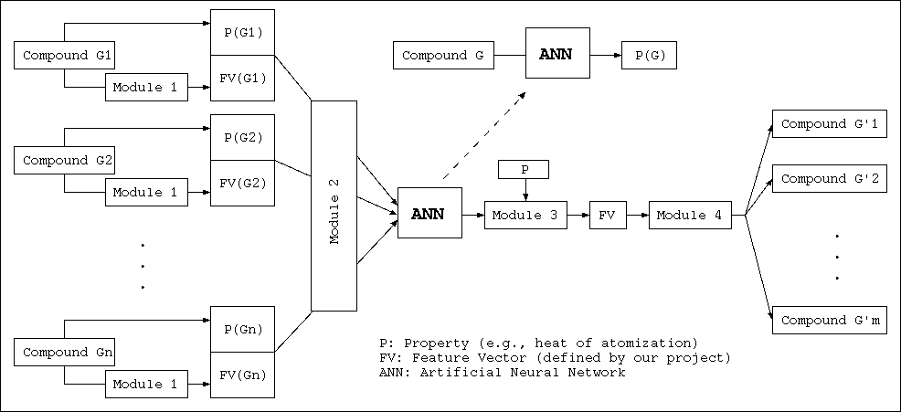

WARN: at the current point (Sep. 11, 2020) this repository has not been fully prepared. Please wait for some days before we can finish the final development and documentation for a release.

# mol-infer: Molecular Infering

Mol-infer is a project developed by ku-dml, the Discrete Mathematics Lab at Kyoto Univerisity.
After many years research on original graph algorithms for infering molecular,
we decided to open-source our programs for public use.
If you found it was useful in your research, please consider to cite our following paper as well as this GitHub repository.

> N.A. Azam, J. Zhu, Y. Sun, Y. Shi, A. Shurbevski, L. Zhao, H. Nagamochi and T. Akutsu, A Novel Method for Inference of Acyclic Chemical Compounds with Bounded Branch-height Based on Artificial Neural Networks and Integer Programming, Preprint (arxiv), 2020.

## Introduction

This project consists of four modules who are illustrated in the following picture.



+ Module 1 calculates a *feature vector* (FV) for chemical compound(s) given by a standard *Structure Data File* (SDF), where FV is a mapping from compound to vector data. See [Module 1](Module_1/) for detail.
+ Module 2 constructs an *Artificial Neural Network* (ANN) that learns from known chemical compounds (given by FVs) and their properties. Thus this ANN can be used to infer the property of a given chemical compound. See [Module 2](Module_2/) for detail.
+ Module 3 implements a *Mixed-Integer Linear Programming* (MILP) formulation
that infers **a vector of graph descriptors** given a target property and the
ANN trained by Module 2. See [Module 3](Module_3/) for detail.
+ Module 4 provides two programs that, given a FV, generates (??enumerates??)
acyclic chemical graphs that satisfy the FV based on the *2-branch structure characterization* (see [our paper](arxiv)).
The difference is that the first program outputs graphs of 2-branch-number *2*,
whereas the second outputs graphs of 2-branch-number *4*. See [Module 4](Module_4/) for detail.

In order to understand how they deal with these tasks, one may need to read [our paper](arxiv).

## Requirement

Modules 1 and 4 are written in C++.
Any compiler compatible with ISO C++ 2011 standard should work.
We have tested g++ on Linux Mint 18, 19, and 20 which (if not installed) can be installed by the next command.
```shell
$ sudo apt install g++
```

Modules 2 and 3 are written in Python.
Python 3 and libraries scikit-learn, PuLP, pandas, numpy are necessary. On Linux Mint 18/19/20, they can be installed by the next command.
```
$ sudo apt install python3-sklearn python3-pulp python3-pandas python3-numpy
```

### Other OS

#### Windows

To be provided.

#### Mac OS

To be provided.

## Compile

This is only needed for Modules 1 and 4. On Linux Mint 18/19/20, it can be done by the following command (supposing the working directory is the root of the package).
```
g++ -std=c++11 -Wall -O3 -o Module_1/fv4_in_ex Module_1/fv4_in_ex.cpp 
g++ -std=c++11 -Wall -O3 -o Module_4/2-branches/2-branches Module_4/2-branches/2-branches.cpp 
g++ -std=c++11 -Wall -O3 -o Module_4/3-branches/3-branches Module_4/3-branches/3-branches.cpp 
```

## Usage

See the user's manual in each module.

## Acknowledgement

This project is partially supported by JSPS Grant (KAKENHI) 18H04113.
